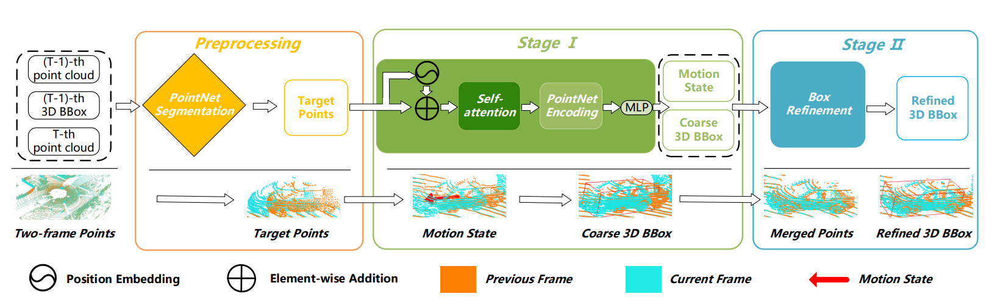

## PPE: Point Position Embedding for Single Object Tracking in Point Clouds



### Results on KITTI dataset

| Method                 | Car  | Pedestrian | Van  | Cyslist | Mean |
| ---------------------- | ---- | ---------- | ---- | ------- | ---- |
| **Success_M2-Track**   | 65.5 | 61.5       | 53.8 | 73.2    | 62.9 |
| **Success_Ours**       | 67.9 | 63.9       | 53.2 | 76.0    | 65.0 |
|                        |      |            |      |         |      |
| **Precision_M2-Track** | 80.8 | 88.2       | 70.7 | 93.5    | 83.4 |
| **Precision_Ous**      | 81.0 | 90.0       | 69.8 | 94.0    | 84.2 |


### [Set up](#jump)


##### <span id='jump'>create the environment</span>

- ##### installation

	```
	git clone  https://github.com/GZHU-DVL/PPE.git
	cd PPE
	conda create -n ppe python=3.8
	conda activate ppe
	conda install pytorch==1.8.1 torchvision==0.9.1 torchaudio==0.8.1 cudatoolkit=11.3 -c pytorch -c conda-forge
	pip install -r requirement.txt
	pip install pointnet2_ops_lib/.
	```

	


##### KITTI dataset setup

- #####       Download the data for [velodyne](http://www.cvlibs.net/download.php?file=data_tracking_velodyne.zip), [calib](http://www.cvlibs.net/download.php?file=data_tracking_calib.zip) and [label_02](http://www.cvlibs.net/download.php?file=data_tracking_label_2.zip) from [KITTI Tracking](http://www.cvlibs.net/datasets/kitti/eval_tracking.php).  

- #####       Unzip the downloaded files. 

- #####       Put the unzipped files under the same folder as following

	```
	[Parent Folder]
	--> [calib]
	    --> {0000-0020}.txt
	--> [label_02]
	    --> {0000-0020}.txt
	--> [velodyne]
	    --> [0000-0020] folders with velodynes .bin files
	```


##### NuScenes dataset setup

- [Download the dataset](https://www.nuscenes.org/download)

- Extract the downloaded files and make sure you have the following structure:

	```
	[Parent Folder]
	  samples	-	Sensor data for keyframes.
	  sweeps	-	Sensor data for intermediate frames.
	  maps	    -	Folder for all map files: rasterized .png images and vectorized .json files.
	  v1.0-*	-	JSON tables that include all the meta data and annotations. Each split (trainval, tes
	```

### [Quick start](#start)


##### <span id='start'>Evaluating our pre-trained models</span>

```
python main.py  --cfg cfg/kitti.yaml  --checkpoint ./pretrain/ppe_kitti_car.ckpt --test --preloading
```

##### The [kitti.yaml](https://github.com/GZHU-DVL/PPE/kitti.yaml) file contains all the configurations of the dataset and the model. We provide `.yaml files in the cfg directory. 

##### Note: Before running the code, you will need to edit the `.yaml` file by setting the `path` argument as the correct root of the dataset and select the category you want to test.


##### Training your models

```
CUDA_VISIBLE_DEVICES=0,1 python main.py  --cfg cfg/kitti.yaml  --batch_size 32 --epoch 60 --preloading

```


##### Testing your models

```
python main.py  --cfg cfg/kitti.yaml  --checkpoint /path/to/checkpoint/xxx.ckpt --test
```


##### After you start training, you can start Tensorboard to monitor the training process:

```
tensorboard --logdir=./
```


##### Citation

##### Our code is extended from the following repositories. We thank the authors for releasing the codes.

- ##### [M2-Track](https://github.com/Ghostish/Open3DSOT)

- [Pointnet++](https://github.com/erikwijmans/Pointnet2_PyTorch)

